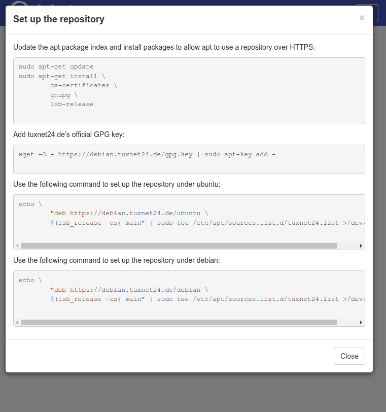

# Apache Filebrowser

This is a responsive apache filebrowser theme, based on [bootstrap 3.3.7](https://getbootstrap.com/docs/3.3/ "Bootstrap 3.3.7").

You can use the theme as Apache Index Listing, for this the logo [img/logo.png](indexlisting/img/logo.png "logo.png") (230x50) would have to be replaced with your own.

## Installation

1. copy the directory indexlisting in the directory where Apache should show an index listing.
2. copy the .htaccess file into the DocumentRoot of your site and adjust the paths /indexlisting/ to the location of your site.
3. activate the option AllowOverwrite in your Apache configuration for your Vhost.

### Example

Your DocumentRoot is ``/var/www/mysite`` and the directory ``/var/www/mysite/files`` you want to have an index listing with this theme. Then you copy the directory indexlisting to ``/var/www/mysite/files/indexlisting`` and adjust the paths ``/indexlisting/`` to ``/files/indexlisting/`` in the ``/var/www/mysite/.htaccess`` file.

Vim is your best friend (search/replace) ;-p

## Screenshots

**Original View**

**Light mode**

**Dark mode**

**Mobile dark mode**

**Mobile ight mode, display help**

